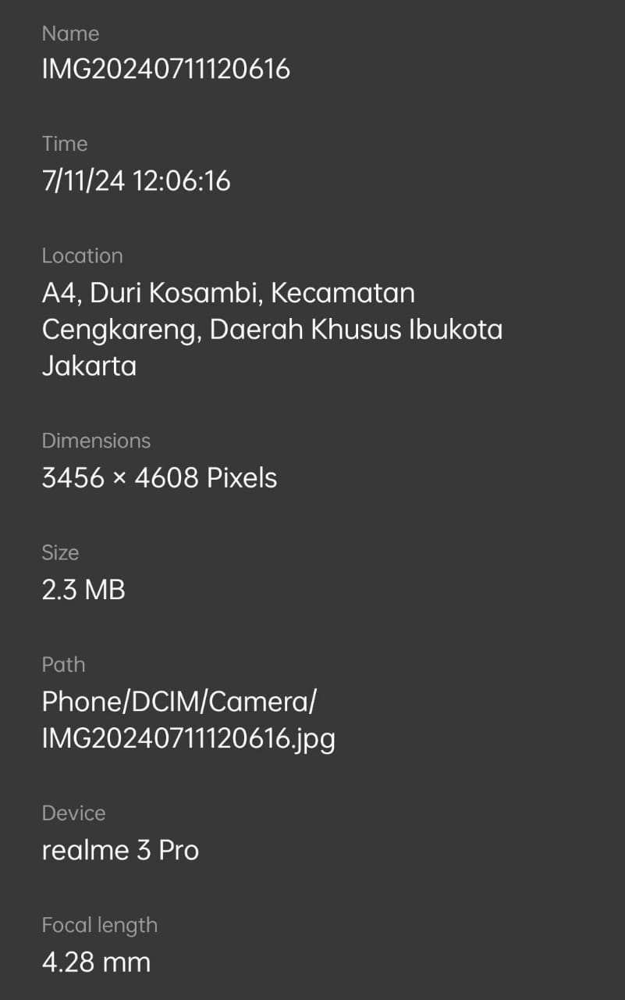
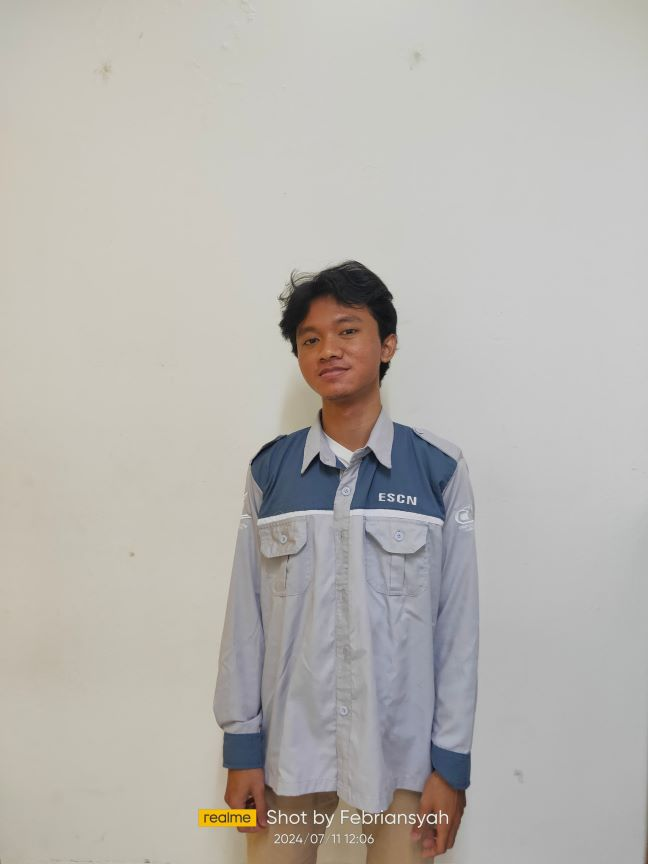

# Laporan Praktikum UAS - Pengolahan Citra Digital B


## Authors
    Nama        : Febriansyah
    NIM         : 202231049
    Mata Kuliah : Pengolahan Citra Digital B 
- [@Suryzw](https://github.com/Suryzw)
## Roadmap

- Menampilkan Gambar/Citra
- Mengkonversi citra dari BGR ke GRAY
- Memfilter citra dengan menggunakan mean
- Memfilter citra dengan menggunakan median
- Menampilkan perbedaan antara citra asli dengan citra yang sudah difiltering menggunakan mean
- Menampilkan perbedaan antara citra asli dengan citra yang sudah difiltering dengan menggunakan median
## Teori Pendukung

- **Ketetanggaan piksel (pixel neighborhood)** adalah konsep dalam pengolahan citra yang merujuk pada kumpulan piksel di sekitar piksel tertentu dalam sebuah gambar. Ketetanggaan piksel sering diterapkan dalam berbagai operasi pengolahan citra seperti penyaringan, pendeteksian tepi, dan penghalusan.
- Library `cv2` adalah singkatan dari OpenCV (Open Source Computer Vision Library), sebuah library open-source yang berisi berbagai fungsi dan algoritma untuk pengolahan citra dan visi komputer. Library ini menyediakan berbagai fitur untuk memproses gambar dan video, seperti manipulasi citra, deteksi objek, pengenalan pola, dan banyak lagi.
- Library `matplotlib.pyplot` adalah bagian dari paket matplotlib, yang merupakan library Python yang digunakan untuk membuat visualisasi data dalam bentuk grafik. 
- Library `numpy` adalah library Python yang berfokus pada operasi numerik. NumPy menyediakan objek array yang mendukung array multidimensi dan berbagai fungsi untuk bekerja dengan array tersebut. 
- Fungsi `astype(float)` dalam konteks array numpy (atau gambar yang direpresentasikan sebagai array numpy) digunakan untuk mengonversi tipe data elemen array menjadi tipe data float
- Fungsi `plt.subplots` dalam Matplotlib digunakan untuk membuat sebuah figur dan satu atau lebih subplot di dalamnya
- Fungsi `cv2.imread()` digunakan untuk membaca file gambar kita
- Fungsi `.copy()` digunakan untuk membuat salinan dari array atau gambar dan menyimpannya dalam variabel baru
- Fungsi `cv2.cvtColor()` digunakan untuk mengkonversi warna gambar
- Fungsi `cv2.medianBlur()` digunakan untuk menggunakan fungsi blur berdasarkan nilai median yang sudah disediakan oleh cv2.
## Langkah Pengerjaan

1. Gunakan [Jupyter Notebook](https://jupyter.org/install) atau [Google Colabs](https://colab.google/) 
2. Buat file .ipynb baru
3. Import library yang dibutuhkan, seperti `cv2`, `matplotlib.pyplot`, dan `numpy`

    ```
    import cv2
    import matplotlib.pyplot as plt
    import numpy a np
    ```
4. Import gambar yang ingin digunakan, dalam hal ini saya gunakan file dengan nama **gbrDiri.jpg**.


Menyimpannya ke dalam variabel `gbrDiri`. Setelahnya, kita mengkonversi gambar dari BGR ke RGB. Gunakan perintah berikut:
    ```
    gbrDiri = cv2.imread('gbrDiri.jpg') #untuk mengimport gambar 
    gbrDiri = cv2.cvtColor(gbrDiri, cv2.COLOR_BGR2RGB) #konversi BGR ke RGB
    ```

### Filtering Menggunakan Mean

5. Sebelum melakukan filtering menggunakan mean/rata-rata, kita akan melakukan operasi ketetanggan pixel yang bertujuan untuk memanfaatkan informasi dari piksel-piksel tetangga guna meningkatkan kualitas dan analisis gambar. Untuk melakukan ketetanggan pixel, dapat dilakukan/menuliskan perintah berikut : 
    ```
    gbrMean = gbrDiri.copy()
    gbrMean = cv2.cvtColor(gbrMean, cv2.COLOR_BGR2GRAY) #konversi gambar dari BGR ke GRAY
    gbrMean = gbrMean.astype(float) 
    m1,n1 = gbrMean.shape # Mengambil ukuran gambar
    output1 = np.empty([m1,n1])

    print("Shape copy gambar 1 : ", gbrMean.shape)
    print("Shape output gambar 1 : ", output1.shape)

    print("m1 : ",m1)
    print("n1 : ",n1)
    ```
**Penjelasan singkat pada langkah 5:**

Kode di atas menyiapkan gambar untuk pemrosesan lebih lanjut dengan menyalin gambar asli dari variabel `gbrDiri`, mengonversinya ke grayscale dengan menggunakan `cv2.cvtColor(gbrMean, cv2.COLOR_BGR2GRAY)`, mengubah tipe datanya menjadi float, dan membuat array kosong untuk menyimpan hasil pemrosesan. Informasi tentang ukuran gambar dicetak untuk verifikasi sebelum melanjutkan ke tahap pemrosesan berikutnya.

6. Setelah menuliskan perintah di atas, setelahnya kita dapat melakukan operasi filtering dengan menggunakan mean dengan perintah berikut :  
    ```
    for baris in range(0, m1-1):
        for kolom in range(0,n1-1):
            a1 = baris
            b1 = kolom
            jumlah = (gbrMean[a1-1,b1-1]+ gbrMean[a1-1,b1] + gbrMean[a1-1,b1+1] +
                    gbrMean[a1,b1-1] + gbrMean[a1,b1] + gbrMean[a1,b1+1] +
                    gbrMean[a1+1,b1-1]+ gbrMean[a1+1,b1] + gbrMean[a1+1,b1+1])
            output1[a1,b1] = jumlah/9
    ```

**Hasil Analisis pada langkah 6 :** 

Kode ini melakukan operasi penyaringan rata-rata pada setiap piksel dalam gambar **gbrMean**, kecuali piksel di tepi, dan menyimpan hasilnya di **output1**. Hal ini membantu menghaluskan gambar dengan mengurangi variasi intensitas yang tajam, seperti noise, dengan mengganti nilai setiap piksel dengan rata-rata nilai tetangganya.

7. Setelah menuliskan kode untuk filtering dengan menggunakan mean, kita dapat menampilkan hasil gambar sebelum filtering dengan gambar setelah filtering dengan menggunakan mean.
    ```
    fig, axis = plt.subplots(1,2, figsize=(10,10))
    ax = axis.ravel()

    ax[0].imshow(gbrMean, cmap='gray')
    ax[0].set_title("Citra Asli")

    ax[1].imshow(output1, cmap='gray')
    ax[1].set_title("Citra setelah Mean")
    plt.show()
    ```
**Hasil Perbandingan :** 

Dapat dilihat bahwa gambar sebelah kiri, yaitu gambar asli memiliki tingkat kejelasan yang masih orginal dibandingkan gambar yang sudah difilter menggunakan mean pada gambar sebelah kanan. 

### Filtering Menggunakan Median

8. Ada cara lain jika kita ingin melakukan filter citra membuat gambar/citra menjadi blur, yaitu dengan menggunakan `cv2.medianBlur()`. `cv2.medianBlur()` adalah fungsi sudah disediakan oleh library `cv2`.

Berikut adalah baris kode untuk mengimplmentassikan fungsi `cv2.medianBlur` :

```
gbrMedian = gbrDiri.copy()
gbrMedianAfter = cv2.medianBlur(gbrMedian, 5)

fig,axis = plt.subplots(1,2,figsize=(10,10))
ax=axis.ravel()

ax[0].imshow(gbrMedian, cmap='gray')
ax[0].set_title("Gambar asli")

ax[1].imshow(gbrMedianAfter, cmap='gray')
ax[1].set_title("Gambar Setelah Median")
plt.show()

```
**Hasil Analisis pada langkah 8 :**

Gambar asli `gbrDiri` disalin ke variabel `gbrMedian` untuk menjaga agar gambar asli tetap utuh selama pemrosesan. Kemudian, filter median dengan ukuran kernel 5x5 diterapkan pada salinan gambar ini menggunakan fungsi `cv2.medianBlur`, menghasilkan gambar baru yang disimpan dalam variabel `gbrMedianAfter`. Filter median berfungsi untuk mengurangi noise pada gambar dengan menggantikan nilai setiap piksel dengan nilai median dari piksel-piksel tetangganya dalam jendela kernel 5x5. Setelah pemrosesan selesai, gambar asli dan gambar hasil pemrosesan ditampilkan berdampingan menggunakan *Matplotlib*. Fungsi `plt.subplots` digunakan untuk membuat dua subplot dalam satu figur berukuran 10x10. Gambar asli ditampilkan pada subplot pertama (ax[0]) dengan skema warna grayscale dan diberi judul "Gambar asli". Gambar hasil filter median ditampilkan pada subplot kedua (ax[1]) dengan skema warna grayscale dan diberi judul "Gambar Setelah Median". Akhirnya, `plt.show()` dipanggil untuk menampilkan figur yang memuat kedua gambar tersebut.